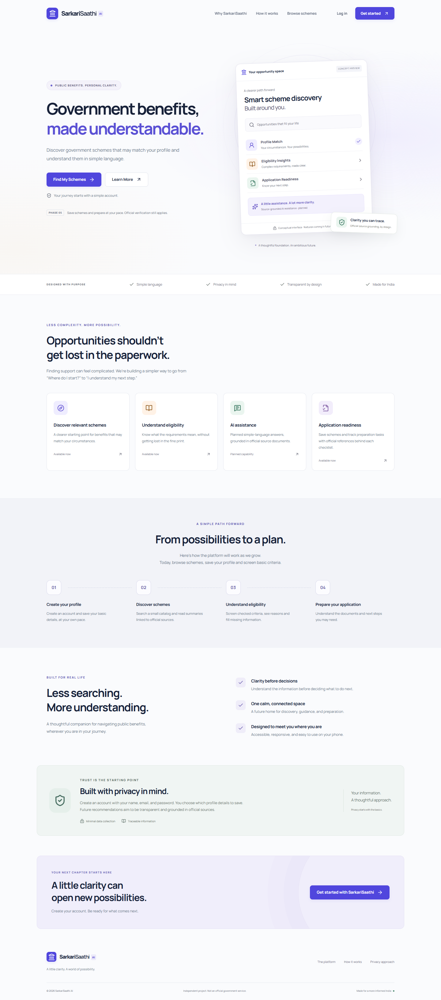
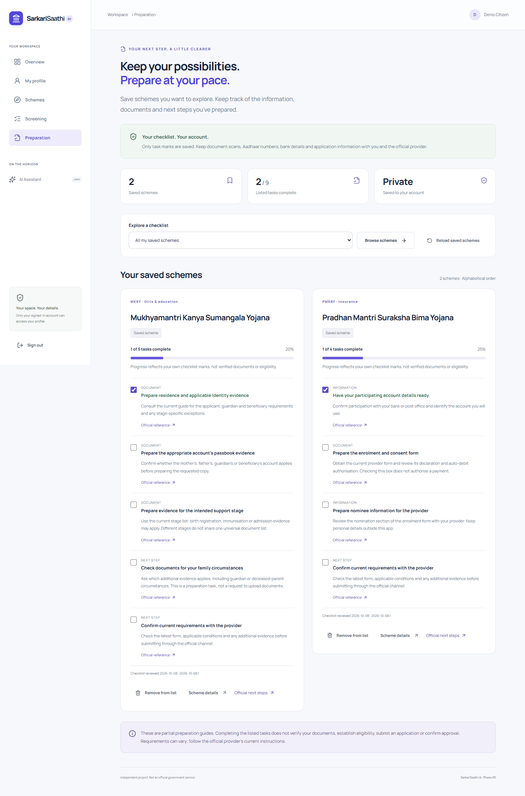

# SarkariSaathi AI — Phases 1–5

A MERN application for understanding government schemes. Phase 1 provides authentication and a polished responsive interface. Phase 2 adds private citizen profiles. Phase 3 adds public official-source scheme browsing. Phase 4 adds explainable, partial screening of basic criteria for the six catalog schemes. Phase 5 adds private saved schemes and source-linked preparation checklists. This is an independent project, not an official government service.

## Screenshots





See the [desktop and mobile screenshot gallery](docs/screenshots/README.md) for all nine pages. Captured from the completed local production build with synthetic demo data. Run `npm run screenshots` with the API, seeded catalog and frontend running to regenerate them.

## Phase 5: application readiness

Open [preparation](http://localhost:5175/readiness) after signing in. Workspace navigation and the dashboard open your saved list; scheme details and screening results open `/readiness?scheme=<slug>`. Login retains that safe internal destination. Preview any of the six checklists, save a scheme, and mark or unmark individual tasks. Saved schemes and confirmed progress persist through refresh and signing in again. Official references appear beside each task, with a separate official next-steps link.

Progress means **self-marked completion of the listed preparation tasks**, not eligibility, document verification, a submitted application, payment consent or government approval. Templates are partial preparation guides; the provider determines the current complete requirements. UP evidence varies by support stage and family circumstances, and bank KYC alternatives vary by the applicable process. No uploads, Aadhaar/bank numbers, document contents or free-text notes are collected. Only scheme slugs and task marks are stored in the new owner-scoped `SavedScheme` collection, with version/revision metadata and timestamps. Users and profiles are unchanged.

| Protected endpoint            | Contract                                                                                                                      |
| ----------------------------- | ----------------------------------------------------------------------------------------------------------------------------- |
| `GET /api/readiness`          | `{ success: true, entries }`; catalog previews merged with only the account's saved progress, alphabetical, no writes         |
| `PUT /api/readiness/:slug`    | Empty JSON object; idempotently saves a current catalog entry without resetting marks or changing existing timestamps         |
| `PATCH /api/readiness/:slug`  | `{ itemId, completed, templateVersion, revision, saveId }`; updates one supported task and returns `{ success: true, entry }` |
| `DELETE /api/readiness/:slug` | `{ revision, saveId }`; removes that account's saved scheme and marks; resaving starts empty                                  |

PUT also returns `{ success: true, entry }`. DELETE returns `{ success: true, message }`. Entries include scheme identity, availability, saved state, opaque `saveId`, revision, timestamps, template version/review date, source-linked items and server-calculated progress. No owner IDs or internal account data are exposed. Use the last returned integer `revision`, opaque `saveId` and current `templateVersion` for changes. Atomic owner/revision/save-ID checks reject stale mutations with 409, including an old window after removal and resaving. Missing rows return 404. Strict schemas reject owner overrides, unknown tasks/fields and string booleans. Mutations have a separate 120/minute per-IP limit; existing JWT, CORS, Helmet and body limits apply. Successful responses use `Cache-Control: no-store`.

Checklists live in `server/src/domain/readiness.js`, reviewed 8 October 2026, version `2026-10-08.1`. A changed template withholds old marks until reconfirmed; GET never silently rewrites stored progress. Unreviewed or removed catalog entries show no invented tasks or complete progress. Removed entries remain removable. Failed or uncertain network responses preserve the last confirmed UI state and offer reload to reconcile with the server. Private content resets on account changes; rejected sessions clear authentication. Removal uses an accessible confirmation dialog.

New reusable pieces: ReadinessCard, RemoveSavedDialog, useReadiness and `readiness.css`. Five workspace links fit the mobile navigation grid. Native checkboxes, focus restoration, loading/error/retry states, notifications and reduced motion are verified. No dependency, secret, migration or environment change is required. See [preparation source notes](docs/READINESS-SOURCES.md) and [Phase 5 verification](docs/PHASE5-VERIFICATION.md).

## Phase 4: explainable screening

Open [screening](http://localhost:5175/eligibility) after signing in, through workspace navigation, the dashboard or a scheme detail. A detail opens `/eligibility?scheme=<slug>`; login safely retains that internal destination. Choose one scheme or all six. Saved profile facts provide the starting point, while native Yes/No/Not sure controls and a UP-stage select fill missing facts. Additional answers are sent only when Run screening is pressed and are **not persisted** to MongoDB or browser storage. They reset on refresh, route departure, account change or Reload saved details. Reset answers clears local answers and requires a new screen if they differ from the previous submission.

Results show **Basic criteria match**, **More information needed**, or **A checked criterion isn’t met**, with rule-by-rule reasons, missing-information actions, official references, limitations, review date and rule version. A known failure takes precedence over unknown facts without hiding those unknowns. Edited answers hide the previous report until it is rerun. Results stay alphabetical; there are no recommendation rankings, confidence scores or approval claims. Unsupported future catalog entries are explicitly Not screened.

This screens **new applications only** and deliberately covers a subset of conditions. Occupation does not imply land ownership; household income does not imply tax history. APY asks about current and past income-tax status and, at age 40, whether the application date is no later than the 40th birthday. PMSBY age 70 requires provider clarification because whole-year age cannot resolve its exact termination rule. UP uses saved residency/income only after confirming they describe the girl’s family; the account holder’s age never becomes the girl’s age. Stage and family exceptions are self-confirmed. Full documents, land/title conditions, KYC, payments, nomination, renewal and official approval remain provider responsibilities. See [rule coverage and provenance](docs/SCREENING-RULES.md).

| Protected endpoint      | Contract                                                                                                            |
| ----------------------- | ------------------------------------------------------------------------------------------------------------------- |
| `GET /api/eligibility`  | Baseline report using the authenticated account’s current saved profile and unknown additional facts; no writes     |
| `POST /api/eligibility` | `{ "answers": { "existingBankAccount": false } }`; only supported boolean/null facts and an optional valid UP stage |

Both return `{ success: true, profile, questions, results, counts, ruleVersion, reviewedAt, checkedAt }` and `Cache-Control: no-store`. `profile` is a safe snapshot containing age, state, annualHouseholdIncome and updatedAt only. `questions` supplies labels, helpers and official sources. Each result contains a safe scheme summary plus `assessment: { status, rules, missing, sources, limitations, ruleVersion, reviewedAt }`; each rule has a status, reason, source and input origin. The backend reads the owner from the JWT and rereads the saved profile on every screen. Unknown keys, string booleans, client profile/owner/result overrides and invalid stages return 400. POST has a separate 60/minute per-IP in-memory limit. Existing JWT, CORS, Helmet and 16KB body limits apply.

Rules are reviewed static JavaScript in `server/src/domain/eligibility.js`, version `2026-10-08.1`. They are independent of the editorial MongoDB catalog. Screening needed no new collection, migration, dependency, secret, external AI service or environment setting. New reusable pieces: AssessmentCard, ScreeningQuestion, useEligibility, shared status labels, safeReturnPath and `eligibility.css`. Workspace links use a two-column grid on mobile; radios, disclosures, focus after submission, loading/error/retry states and reduced motion are verified.

## Phase 3: official scheme browsing

Open [the scheme library](http://localhost:5175/schemes). Six manually reviewed schemes cover agriculture, insurance, pensions, banking, and girls’ education. Browse without an account; search names, acronyms and keywords, filter category/central-or-state/location, and open detail pages for benefits, intended audience, next steps and official references. Query parameters persist search/filter/page state through refresh, sharing and browser history. Details retain the list query in their URL, so Back to schemes preserves the current view.

The catalog is a small editorial collection, not a comprehensive directory. Central schemes are included for every location; state-scheme coverage currently includes Uttar Pradesh only. Filters describe scheme coverage, not personal eligibility. Profiles do not populate filters or influence browsing order (alphabetical). Screening is a separate signed-in action; browsing does not automatically screen a person.

Scheme records live in a separate MongoDB collection. Load/update the reviewed catalog with `npm run seed:schemes`. This explicitly upserts six stable slugs, validates HTTPS government source URLs, preserves unrelated catalog records, and never deletes or edits users/profiles. Startup initializes scheme indexes but does not silently seed data. A fresh database displays an honest empty-library state until seeding. Re-running the seed overwrites editorial fields for those six slugs, including fixed review dates; it does not perform a fresh web review.

Editorial data: `server/src/data/schemes.js`. Review process and provenance: [catalog source notes](docs/CATALOG-SOURCES.md). Review date: 8 October 2026, separate from source publication/update dates. Official pages may change or be temporarily unavailable; every detail page directs readers to confirm current terms with the provider.

| Public endpoint          | Contract                                                   |
| ------------------------ | ---------------------------------------------------------- |
| `GET /api/schemes`       | `{ success: true, schemes, pagination, filters, catalog }` |
| `GET /api/schemes/:slug` | `{ success: true, scheme }`; safe 404 when missing         |

List query options: `q` (trimmed, max 100 characters, case-insensitive literal substring), `category` (agriculture, insurance, pension, banking, women-education), `level` (central/state), `state` (one of 36 shared states/UTs), `page` (1–10000, default 1), and `limit` (1–24, default 6). Filters combine with AND; location includes national schemes plus state schemes covering that location. Unknown/repeated query keys and invalid values return 400. Pagination returns totals and totalPages (0 for no results); out-of-range pages have no items. Changing UI filters resets page. Summaries omit details/internal metadata; details omit database IDs, search fields and timestamps. Both endpoints are read-only and use `Cache-Control: no-store`.

New UI pieces: SchemeCard, Schemes, SchemeDetail, useSchemes, shared labels/date formatting, and `schemes.css`. Aborted requests prevent stale results; loading skeletons, empty states, safe errors and retry are provided. Native selects/search forms, labelled controls, live result counts, source-anchor focus, mobile navigation and reduced motion preserve keyboard behavior. No additional dependencies or environment variables were needed.

## Phase 2: citizen profile setup

Open `/profile` from My profile or the dashboard's Profile Setup card. You can save an incomplete draft, return after signing in again, edit saved details, and reset unsaved changes. Profile completion describes data readiness only; it is not a scheme eligibility result.

| Detail                  | Validation                                       | Completion |
| ----------------------- | ------------------------------------------------ | ---------- |
| Age                     | Integer 0–120; blank is null                     | Core       |
| State / Union Territory | One of the shared 36 options; blank is null      | Core       |
| Occupation              | One of the shared choices; blank is null         | Core       |
| Annual household income | Whole rupees, 0–1,000,000,000; blank is null     | Core       |
| District                | Optional, trimmed, 2–80 characters when supplied | Optional   |

Each valid core field contributes 25%. Zero age/income count as supplied values. The income upper bound is an input limit, not an eligibility threshold. Changing state in the form clears district. The form clearly distinguishes unsaved draft progress from saved dashboard progress; details are never automatically saved to localStorage.

Profiles have a separate MongoDB collection with one unique owner per authenticated account. Existing account records and authentication response contracts are unchanged; no data migration is required. Names/emails shown on the profile page remain account identity and are not editable in this phase. State/UT choices use current names, including the merged Dadra and Nagar Haveli and Daman and Diu territory and Ladakh. Sources: [Ministry of Panchayati Raj directory](https://panchayat.gov.in/en/state-ut-panchayati-raj-department-website/) and [merged UT administration](https://ddd.gov.in/introduction/).

`GET /api/profile` and `PUT /api/profile` require the same bearer JWT as `/auth/me`. Both return `{ success: true, profile, completion }`. GET supplies empty values and zero completion when no profile has been saved, without creating a record. PUT replaces all profile details; send the four core keys, each either a valid value or null, plus the optional district string. Unknown keys, owner IDs, account updates, and client-supplied completion are rejected. The owner always comes from authentication. Responses exclude internal owner IDs and set `Cache-Control: no-store`.

```json
{
  "age": 22,
  "state": "Uttar Pradesh",
  "district": "Muzaffarnagar",
  "occupation": "student",
  "annualHouseholdIncome": 240000
}
```

`profile` includes these five fields and `createdAt`/`updatedAt`. `completion` includes `percentage`, `completedFields`, `totalFields`, `isComplete`, and `missingFields`. There are no recommendations, matching rules, or AI calls behind completion.

New reusable pieces: WorkspaceLayout, SelectField, ProfileProgress, LeaveProfileDialog, useProfile, and shared profile choices/completion logic. The router now uses a data router so in-app navigation can warn about unsaved edits. The native dialog supports Escape, focus restoration, and focus wrapping; refresh/close prompts use the browser's beforeunload behavior.

## Run locally

Requirements: Node.js 22.12+ (verified environment: Node 24), npm, and a running local MongoDB service. Run commands from `sarkari-saathi-ai`.

```powershell
npm install
# Environment files are already configured locally for this delivery.
# For a fresh checkout:
Copy-Item server/.env.example server/.env
Copy-Item client/.env.example client/.env
# Replace JWT_SECRET with a cryptographically random secret, at least 32 characters.
npm run seed:schemes
npm run dev
```

**This delivery runs at http://localhost:5175** because ports 5173 and 5174 were already occupied. Example configuration defaults to 5173 for a fresh checkout. API health: http://localhost:5000/api/health. The API and production preview are left running for manual testing.

Changing the frontend port requires updating both `VITE_DEV_PORT` in `client/.env` and `CLIENT_URL` in `server/.env`, then restarting both processes. Open the browser using `localhost` to match the exact CORS origin.

Separate terminals:

```powershell
npm run dev -w server
npm run dev -w client
```

Production frontend check:

```powershell
npm run build
npm run preview -w client
```

## Environment configuration

| Location    | Variable       | Development value / purpose                           |
| ----------- | -------------- | ----------------------------------------------------- |
| server/.env | PORT           | 5000                                                  |
| server/.env | MONGO_URI      | mongodb://127.0.0.1:27017/sarkari_saathi_ai           |
| server/.env | JWT_SECRET     | Random private secret; never commit                   |
| server/.env | JWT_EXPIRES_IN | 7d; accepts integer with s, m, h, or d suffix         |
| server/.env | CLIENT_URL     | http://localhost:5173; exact allowed browser origin   |
| server/.env | NODE_ENV       | development, production, or test                      |
| client/.env | VITE_API_URL   | http://localhost:5000/api; public URL, never a secret |
| client/.env | VITE_DEV_PORT  | 5173 by default; configured locally as 5175           |

The `.gitignore` excludes actual environment files, dependencies, build output, and generated reports. Examples are safe to commit. Do not replace the examples with live credentials. Use `localhost` consistently when opening the frontend because the API allowlist is exact.

## Architecture and folder structure

```text
sarkari-saathi-ai/
  client/
    public/favicon.svg
    src/
      api/axios.js
      components/   # Shared UI, ProfileProgress, dialogs, AssessmentCard, ReadinessCard
      context/AuthContext.jsx
      hooks/        # useReveal, useProfile, useSchemes, useEligibility, useReadiness
      layouts/      # MainLayout.jsx, WorkspaceLayout.jsx
      pages/        # Home, auth, Dashboard, Profile, Schemes, SchemeDetail, Eligibility, Readiness, NotFound
      utils/returnPath.js
      App.jsx
      main.jsx
      styles.css
      profile.css
      schemes.css
      eligibility.css
      readiness.css
    .env.example
    index.html
    vite.config.js
    package.json
  server/
    src/
      config/       # db.js, env.js
      controllers/ # auth, profile, scheme, eligibility and readiness controllers
      domain/       # eligibility.js screening rules; readiness.js preparation templates
      data/schemes.js # Reviewed editorial catalog with source URLs
      middleware/   # authMiddleware.js, errorMiddleware.js
      models/       # User.js, Profile.js, Scheme.js, SavedScheme.js
      routes/       # auth, profile, scheme, eligibility and readiness routes
      utils/        # generateToken.js, seedSchemes.js
      app.js
    scripts/seed-schemes.js
    tests/          # auth, profile, schemes, eligibility and readiness *.test.js
    server.js
    .env.example
    package.json
  shared/profile.js
  shared/schemes.js
  shared/eligibility.js
  tests/            # browser.mjs and profile/schemes/eligibility/readiness-browser.mjs
  scripts/create-postman.mjs
  scripts/audit-phase4.mjs
  scripts/audit-phase5.mjs
  docs/
    SarkariSaathi.postman_collection.json
    VERIFICATION.md
    PHASE2-VERIFICATION.md
    PHASE3-VERIFICATION.md
    CATALOG-SOURCES.md
    SCREENING-RULES.md
    PHASE4-VERIFICATION.md
    READINESS-SOURCES.md
    PHASE5-VERIFICATION.md
  package.json
  package-lock.json
  .gitignore
```

User records contain name, normalized email, bcrypt password hash, and timestamps. MongoDB adds its usual `_id` and version metadata. The unique email index is initialized before the API starts. Registration and login return only safe user data and a signed JWT. AuthContext checks `/auth/me` on refresh, while Axios adds bearer headers and recognizes rejected sessions. Temporary network failures retain the token and show a retry option.

## Packages and rationale

Frontend: React/React DOM for UI, Vite and its React plugin for development/build, React Router for routing, Tailwind CSS and its Vite plugin for utilities, Axios for centralized requests, Lucide React for consistent tree-shaken icons, Sonner for accessible notifications, and Fontsource Manrope for self-hosted fonts. Custom CSS supplies shared tokens, responsive layouts, and lightweight motion; no animation library is needed.

Backend: Express 5 for asynchronous HTTP handlers, Mongoose for MongoDB models, bcrypt for password hashing, jsonwebtoken for HS256 bearer sessions, dotenv for local configuration, Zod for validation, Helmet for HTTP security headers, cors for an explicit origin allowlist, and express-rate-limit for authentication and protected mutation throttling.

Development: concurrently runs frontend/backend together, Node's test runner with Supertest exercises HTTP/database behavior, Playwright verifies real browser flows, Lighthouse audits the production build, and Prettier formats source. The lockfile records installed versions. A shell-quote 1.11.0 override resolves the development runner's critical advisory; npm audit reports zero vulnerabilities.

## API contract

| Method | Endpoint           | Result                                                           |
| ------ | ------------------ | ---------------------------------------------------------------- |
| GET    | /api/health        | 200 `{ success: true, message: "SarkariSaathi API is running" }` |
| POST   | /api/auth/register | 201 `{ success: true, user, token }`                             |
| POST   | /api/auth/login    | 200 `{ success: true, user, token }`                             |
| GET    | /api/auth/me       | 200 `{ success: true, user }`; bearer JWT required               |

Register body: `{ "name": "Devansh", "email": "devansh@example.com", "password": "password123" }`. Login uses email/password. User response fields: `id`, `name`, `email`, `createdAt`, `updatedAt`. Errors: `{ success: false, message }`; validation 400, rejected session/credentials 401, disallowed origin 403, not found 404, duplicate email 409, oversized body 413, authentication throttling 429, unexpected error 500.

Names are trimmed and must contain 2–80 characters. Email is trimmed, lowercased, syntax-checked, and limited to 254 characters. Registration passwords require at least 8 characters and at most 72 UTF-8 bytes; whitespace is preserved. Login accepts existing passwords without reapplying the registration minimum. Secrets are server-only; JWTs use configured expiration and HS256 verification.

## Design system and reusable UI

Colors: ink `#172139`, muted text `#627087`, primary indigo `#5046dd`, off-white canvas, light slate borders, and restrained saffron/green feature accents. Manrope supplies the type hierarchy. Cards use 12–16px radii; controls use 8px radii, consistent heights, subtle shadows, and clear focus states.

Reusable components: Brand; Button (primary, secondary, ghost, danger, loading and disabled states); Field (label, helper/error feedback and password visibility); Loader with skeleton lines; Navbar with mobile menu; Footer; ProtectedRoute; AuthPage; MainLayout. Shared classes provide icon boxes, badges, feature/dashboard cards, section headings, and reveal behavior. AuthProvider supplies user, token, loading, login, register, logout, sessionError, and retry.

Native smooth anchors, IntersectionObserver reveals, approximately 200ms page entrances, 250ms hover effects, and reduced-motion overrides keep animation restrained. Decorative previews are labelled conceptual; unavailable cards are informational and do not use pointer cursors.

## Tests and manual checklist

```powershell
npm test
# Start the API and frontend first, then:
npm run test:browser
npm run test:profile-browser
npm run test:schemes-browser
npm run test:eligibility-browser
npm run test:readiness-browser
# Production frontend build and running API/preview required:
npm run audit:phase5
```

Backend suites create and remove their own uniquely named test databases, with separate names for auth, profile, scheme, screening and readiness tests. They do not wipe the development database. Browser tests create uniquely named synthetic accounts, profiles and saved schemes in the development database; these remain available for inspection. Browser tests use installed Edge or Chrome; set `BROWSER_PATH` for another Chromium executable. The Phase 5 audit defaults to installed Chrome (`CHROME_PATH` override), uses a synthetic account and a persistent browser profile in ignored `reports/`, and preserves storage to reach the private page. Results include authenticated preparation and public detail mobile audits.

Import `docs/SarkariSaathi.postman_collection.json` into Postman. Run the 55 requests in order; Health initializes a unique account email, registration/login capture the token, and readiness mutations capture the returned revision/save ID. Assertions check status/error safety. It creates a synthetic account in the configured API database. All request scripts and substituted JSON parse; equivalent HTTP scenarios run through Supertest. Postman desktop itself was not run. Expired-token and production-error scenarios are covered by the automated backend suite.

See [Phase 5 verification](docs/PHASE5-VERIFICATION.md) for current results and API, browser, responsive, animation and security checklists. Earlier verification records are retained. The current run passed **170 backend/rule tests and 87 browser scenarios**; build succeeded. Measured mobile Lighthouse preparation: **100 performance/100 accessibility/100 best practices/63 SEO** (private route deliberately excluded from crawling); public detail: **100/100/100/100**. These are local audit observations, not a production or real-user performance guarantee.

## Current boundaries and known limitations

- English only; no deployment is included. Hosting later requires SPA route fallback, HTTPS, appropriate origins, and production environment configuration.
- Bearer tokens are stored in localStorage as requested; an XSS vulnerability could expose them. Logout removes the browser token but does not revoke it server-side before expiry. Cookie sessions, refresh tokens, and server revocation are future hardening work.
- Rate limits are held in process memory and reset on restart; a shared store is needed when scaling to multiple instances. No reverse-proxy trust setting is enabled by default.
- Profile drafts save only when explicitly submitted. Unsaved changes can be lost if the user chooses to discard them or signs out; there is no offline persistence or autosave. Concurrent saves use the last successful write.
- Age and household income are self-reported; they are not verified or automatically updated. No account deletion/profile-deletion endpoint is included; saved fields can be emptied and saved again.
- Screening and preparation are partial and self-reported; neither establishes entitlement, verified documents or approval. Sources/templates are manually maintained; there is no automatic tracking of official changes. A task mark can become stale outside the app, so confirm the provider's current requirements before applying.
- Readiness stores only saved schemes and task marks. Removing a saved scheme deletes its progress; resaving starts empty. There is no upload, official application-status tracking or automatic checklist selection from screening answers.
- No password reset, email verification, recommendations, chatbot, RAG, document processing or application submission is implemented.
- The health endpoint reports that the HTTP API is running; it is not a database readiness probe.
- The landing illustration is labelled a conceptual preview. Browsing, partial screening and preparation are available through navigation and the dashboard; AI assistance and personalised recommendations remain future work. There are no invented schemes, counts, testimonials, recommendation scores or security certifications.

Implementation references: [Express asynchronous error handling](https://expressjs.com/en/guide/error-handling/) and [Tailwind's Vite integration](https://tailwindcss.com/docs/installation/using-vite).
